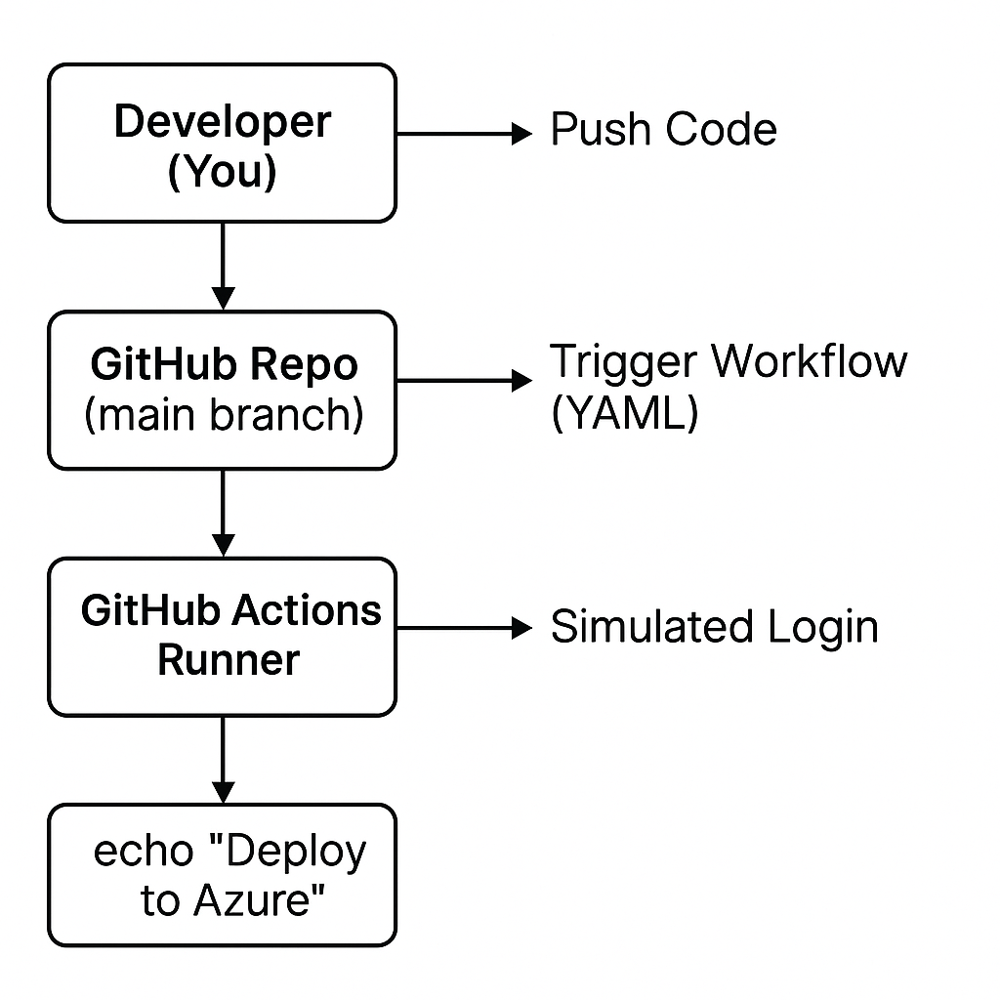

# DevOps Workflow with GitHub Actions + Azure Deployment (Reference Project)

This is a **reference-only architecture project** demonstrating how to set up a CI/CD workflow using **GitHub Actions** to deploy Azure resources like Bicep templates or infrastructure code.

---

## 📁 Project Structure

---

## 🔧 CI/CD Workflow Overview

- Code push to `main` branch triggers a GitHub Actions workflow
- Simulated login to Azure using GitHub Secrets
- Simulated deployment via `echo` command (no real secrets or SPN used)

---

## 🧠 Purpose

✅ Showcase your DevOps + Azure expertise  
✅ Explain architecture concepts in interviews  
✅ Use this as a template for future real-world projects

---

## 🖼 Architecture Diagram

---

## 📜 License

This project is licensed under the **MIT License**.

---

## 💡 Note

> This is a **simulated project** meant for demonstration, learning, and architectural discussions. It does **not** include real credentials or live deployments.

