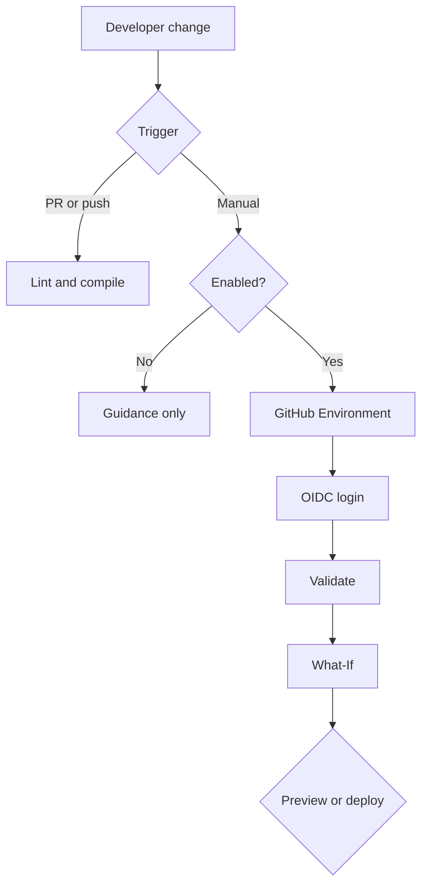
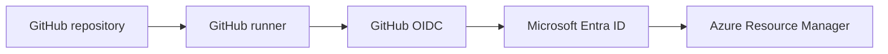

# Architecture

## Component and event flow

## Responsibilities

| Component | Responsibility |
|---|---|
| Git repository | Versioned source of template, workflow, scripts, and learning material |
| Validation workflow | Credential-free lint/build checks |
| Deployment workflow | Manual Azure validation, preview, and optional apply |
| GitHub Environment | Variables, history, and optional approval boundary |
| GitHub OIDC | Issues a short-lived signed identity token |
| Microsoft Entra ID | Validates federation and exchanges the token |
| Azure RBAC | Limits what the identity may do and where |
| Azure Resource Manager | Validates and applies the Bicep desired state |

## Trust boundaries

Validation needs no credentials. Manual deployment avoids accidental provisioning. OIDC avoids long-lived secrets. GitHub Environments isolate configuration and approvals. Existing resource groups reduce identity scope. What-If exposes intended change before deployment.

## Design decisions

- **Separate workflows:** automatic checks remain credential-free.
- **Manual deployment:** a learning repository cannot deploy merely because code was pushed.
- **Two deployment gates:** both the enable variable and deploy input are required.
- **Existing resource groups:** avoids subscription-level resource-group creation rights.
- **Environment parameter files:** one template, typed non-secret differences.
- **Concurrency:** prevents overlapping changes to one environment.
- **Public network enabled:** keeps the example learnable; production must reassess it.

Private endpoints, DNS, diagnostics, Azure Policy, Defender, rollback, application delivery, and multi-region recovery are intentional future extensions.
