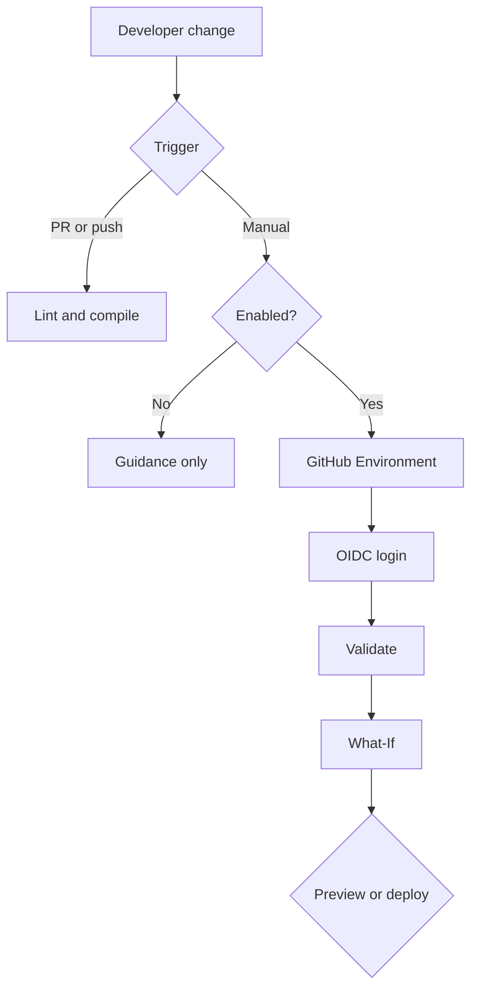

# Architecture

Validation needs no credentials. Manual deployment avoids accidental provisioning. OIDC avoids long-lived secrets. GitHub Environments can isolate variables and approvals. Existing resource groups reduce the example identity's required scope. What-If exposes intended change before deployment.

Private endpoints, DNS, diagnostics, Azure Policy, Defender, rollback, application delivery, and multi-region recovery are intentional future extensions.
