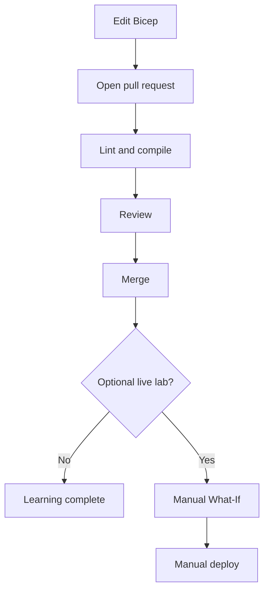

# Fundamentals

## What problem does this project solve?

Cloud resources created manually are difficult to reproduce and review. Infrastructure as Code (IaC) stores the desired configuration in version control. CI/CD then validates and, when deliberately enabled, deploys that configuration consistently.

## Core concepts

| Concept | Simple meaning | This project |
|---|---|---|
| Infrastructure as Code | Describe cloud resources in text files | `infra/main.bicep` |
| Bicep | Azure's declarative IaC language | Declares a Storage Account |
| ARM | Azure control plane that processes deployments | `az deployment group ...` |
| CI | Automatically validate every relevant change | Bicep validation workflow |
| CD | Deliver an approved change to an environment | Manual deployment workflow |
| GitHub Actions | GitHub automation defined in YAML | `.github/workflows` |
| Runner | Temporary machine executing workflow steps | `ubuntu-latest` |
| OIDC | Short-lived identity federation without a stored password | `azure/login@v2` |
| What-If | Preview Azure changes without applying them | Mandatory before deploy |
| GitHub Environment | Named deployment boundary with variables/approvals | dev, test, prod |

## Declarative thinking

Bicep describes the desired end state, not a list of portal clicks. Azure compares desired state with existing state and makes the necessary changes. Reapplying the same template should be idempotent: it should converge on the same state rather than create duplicates.

## Validation levels

1. **Lint:** style and suspicious-pattern feedback.
2. **Build:** translate Bicep into an ARM JSON template.
3. **Build parameters:** confirm parameter files match the template.
4. **Azure validate:** target-specific server validation.
5. **What-If:** predict target changes.
6. **Deploy:** apply desired state.

Only the final stage changes Azure resources.

## Repository flow

