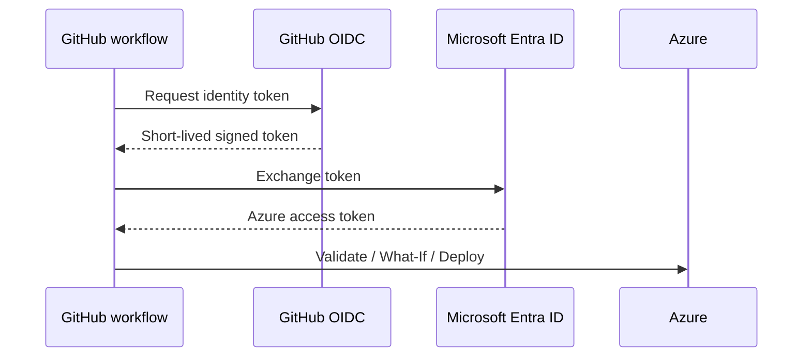

# GitHub-to-Azure OIDC setup

## Why OIDC?

A client secret is long-lived and must be stored, rotated, and protected. OIDC lets GitHub present a short-lived signed identity token. Microsoft Entra ID exchanges it for Azure access only when issuer, audience, and subject match a configured federated credential.

## Trust flow



## Setup outline

1. Create an Entra application or user-assigned managed identity.
2. Note client ID, tenant ID, and subscription ID.
3. Create a federated identity credential for this repository.
4. Assign the identity an appropriate Azure role at the smallest practical scope.
5. Add GitHub variables.
6. Keep client-secret fields empty; this design does not need one.

## Federated subject

When a job uses a GitHub Environment, a typical subject is:

```text
repo:PriyankaManePatil/devops-azure-github-actions:environment:dev
```

Create separate credentials for `dev`, `test`, and `prod` if all are used. A branch-based subject is different:

```text
repo:OWNER/REPOSITORY:ref:refs/heads/main
```

The subject configured in Entra must exactly match the workflow context. The usual audience for Azure public cloud is `api://AzureADTokenExchange`.

## Least privilege

For this sample, assign at the dedicated resource-group scope rather than the whole subscription when possible. Role choice is an organizational decision; avoid Owner. The identity needs permission to read the resource group and create/update the declared resources.

## Common OIDC failures

| Error pattern | Check |
|---|---|
| No matching federated identity | Repository, environment, and subject spelling |
| Audience mismatch | Azure token-exchange audience |
| Missing ID token | Workflow has `id-token: write` |
| Authorization failed | Role assignment, scope, propagation time |
| Wrong subscription | `AZURE_SUBSCRIPTION_ID` and active tenant |

